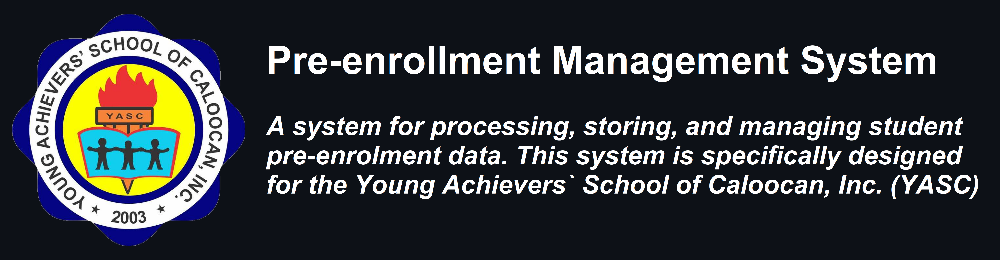

# Pre-enrollment Management System

A system for processing, storing, and managing student enrollment data. This system is specifically designed for the __Young Achievers` School of Caloocan, Inc. (YASC)__. This system's __real-time logging__ allows it to easily record the time-in and time-out of a user's attendance. It has a __simple user interface__ for quick record processing and logging. It also includes a picture of each user to guarantee the person's identification while logging in. This program is useful for schools, as they keep a large database of students' information and attendance records. __I hope you enjoy this system.__

## Features

Planned (❌) and currently working (✔) - but not necessarily fully completed - features:

### Super Admin
- ✔ Enrollment Portal
- ✔ Student Enrollment Data Manager
  - ❌ Generate & Print Student ID
- ✔ Teacher Information Manager
- ✔ Login History Manager
- ✔ About Me
- ✔ Change User Data
- ✔ Change Password
- ✔ Password Recovery

### Admin
- ✔ Enrollment Portal
- ✔ Student Enrollment Data Manager
  - ❌ Generate & Print Student ID
- ✔ About Me
- ✔ Change User Data
- ✔ Change Password
- ✔ Password Recovery

### Teacher
- ✔ Enrollment Portal
- ✔ About Me
- ✔ Change User Data
- ✔ Change Password
- ✔ Password Recovery

### Guest (Public)
- ✔ Enrollment Portal
- ✔ About Me

## How to Use
First, the user must login; if they do not have a login, they can utilize the 'Guest' or public login option. All users can proceed to pre-enroll students once they are in the Main form. However, only users with admin level access can accept or reject students pre-enrollment data. Only the system Super Admin can modify teachers' information and view login history; he or she is also in charge of data management.

## Login Information

### Super Admin

| Username         | Password         |
| ---------------- | ---------------- |  
| NAMIAS           | NAMIAS           |

### Admin

| Username         | Password         |
| ---------------- | ---------------- |  
| BALOD            | BALOD            |
| TUAZON           | TUAZON           |

### Teacher

| Username         | Password         |
| ---------------- | ---------------- |  
| BADONG           | BADONG           |
| BALOD            | BALOD            |
| KAYE             | KAYE             |
| NAMIAS           | NAMIAS           |
| PANELIST         | PANELIST         |

## How to Run

### Requirements
- Download and Install Microsft Visual Studio 2019 or higher version.
- Download and Install Microsft Access Database Engine 2016.

### Setup
1. Clone the repository or Download and Extract the source code zip file.
2. Open the extracted file and locate the solution file known as "YASC Pre-enrollment System.sln".
3. Open the solution file with your Microsoft Visual Studio Software.
4. Press the "F5" key on your keyboard

> Note: Some issues were not yet fixed thus I will be updating this in several upcoming weeks/months. And I hope that this project will be used for educational purposes and that the system itself maintains its copyrights as proposed.

Enjoy :)

## Screenshots

<table>
  <tr>
    <th colspan="1" align="center">1. Login Form (Admin)</th>
  </tr>
  <tr>
    <td></td>
  </tr>
</table>

<table>
  <tr>
    <th align="center">2. Login Form (Teacher)</th>
    <th align="center">3. Login Form (Guest)</th>
  </tr>
  <tr>
    <td></td>
    <td></td>
  </tr>
</table>

<table>
  <tr>
    <th colspan="1" align="center">4. Login Guide</th>
  </tr>
  <tr>
    <td></td>
  </tr>
</table>

<table>
  <tr>
    <th colspan="1" align="center">5. Main Menu (Admin)</th>
  </tr>
  <tr>
    <td></td>
  </tr>
</table>

<table>
  <tr>
    <th align="center">6. Main Menu (Teacher)</th>
    <th align="center">7. Main Menu (Guest)</th>
  </tr>
  <tr>
    <td></td>
    <td></td>
  </tr>
</table>

<table>
  <tr>
    <th colspan="1" align="center">8. Student Emrollment Guide</th>
  </tr>
  <tr>
    <td></td>
  </tr>
</table>

<table>
  <tr>
    <th colspan="1" align="center">9. Enrollment Portal</th>
  </tr>
  <tr>
    <td></td>
  </tr>
</table>

<table>
  <tr>
    <th colspan="1" align="center">10. Class Schedule 1</th>
  </tr>
  <tr>
    <td></td>
  </tr>
</table>

<table>
  <tr>
    <th colspan="1" align="center">11. Class Schedule 2</th>
  </tr>
  <tr>
    <td></td>
  </tr>
</table>

<table>
  <tr>
    <th colspan="1" align="center">12. School Conditions</th>
  </tr>
  <tr>
    <td></td>
  </tr>
</table>

<table>
  <tr>
    <th colspan="1" align="center">13. Data Privacy Notice</th>
  </tr>
  <tr>
    <td></td>
  </tr>
</table>

<table>
  <tr>
    <th colspan="1" align="center">14. Student Reference Number</th>
  </tr>
  <tr>
    <td></td>
  </tr>
</table>

<table>
  <tr>
    <th colspan="1" align="center">15. About Me</th>
  </tr>
  <tr>
    <td></td>
  </tr>
</table>

<table>
  <tr>
    <th colspan="1" align="center">16. Students Pre-enrollment Data 1</th>
  </tr>
  <tr>
    <td></td>
  </tr>
</table>

<table>
  <tr>
    <th colspan="1" align="center">17. Students Pre-enrollment Data 2</th>
  </tr>
  <tr>
    <td></td>
  </tr>
</table>

<table>
  <tr>
    <th colspan="1" align="center">18. Students Pre-enrollment Data 3</th>
  </tr>
  <tr>
    <td></td>
  </tr>
</table>

<table>
  <tr>
    <th colspan="1" align="center">19. Students Pre-enrollment Data 4</th>
  </tr>
  <tr>
    <td></td>
  </tr>
</table>

<table>
  <tr>
    <th colspan="1" align="center">20. Students Pre-enrollment Data 5</th>
  </tr>
  <tr>
    <td></td>
  </tr>
</table>

<table>
  <tr>
    <th colspan="1" align="center">21. Teacher Information Database</th>
  </tr>
  <tr>
    <td></td>
  </tr>
</table>

<table>
  <tr>
    <th colspan="1" align="center">22. Teacher Database Guide 1</th>
  </tr>
  <tr>
    <td></td>
  </tr>
</table>

<table>
  <tr>
    <th colspan="1" align="center">23. Teacher Database Guide 2</th>
  </tr>
  <tr>
    <td></td>
  </tr>
</table>

<table>
  <tr>
    <th colspan="1" align="center">24. Login History Database</th>
  </tr>
  <tr>
    <td></td>
  </tr>
</table>

<table>
  <tr>
    <th colspan="1" align="center">25. Login History Guide</th>
  </tr>
  <tr>
    <td></td>
  </tr>
</table>

<table>
  <tr>
    <th colspan="1" align="center">26. User Information</th>
  </tr>
  <tr>
    <td></td>
  </tr>
</table>

<table>
  <tr>
    <th colspan="1" align="center">27. Change Password</th>
  </tr>
  <tr>
    <td></td>
  </tr>
</table>

<table>
  <tr>
    <th colspan="1" align="center">28. Change Information</th>
  </tr>
  <tr>
    <td></td>
  </tr>
</table>

<table>
  <tr>
    <th colspan="1" align="center">29. Forgot Password</th>
  </tr>
  <tr>
    <td></td>
  </tr>
</table>

<table>
  <tr>
    <th colspan="1" align="center">30. Capture ID Picture</th>
  </tr>
  <tr>
    <td></td>
  </tr>
</table>
